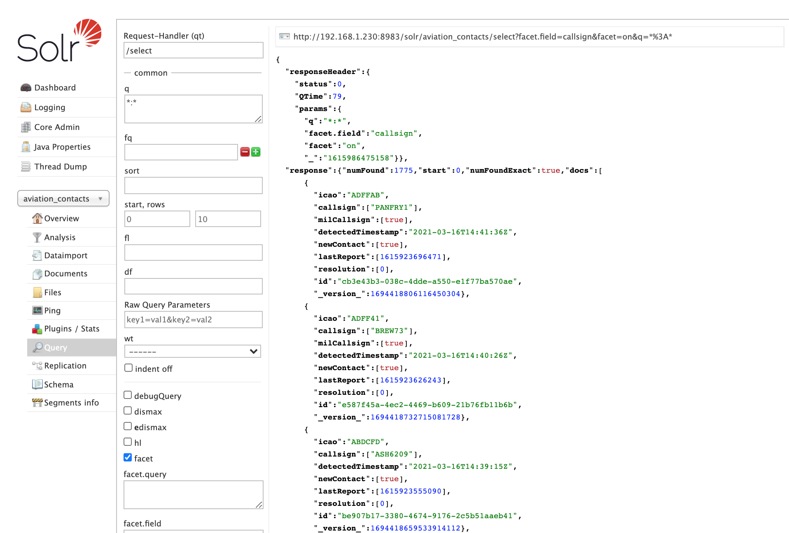
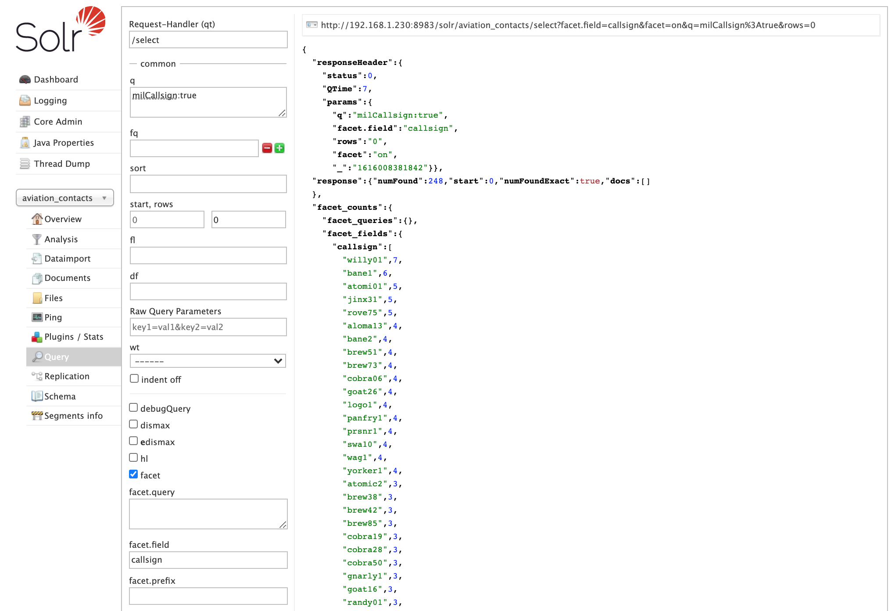
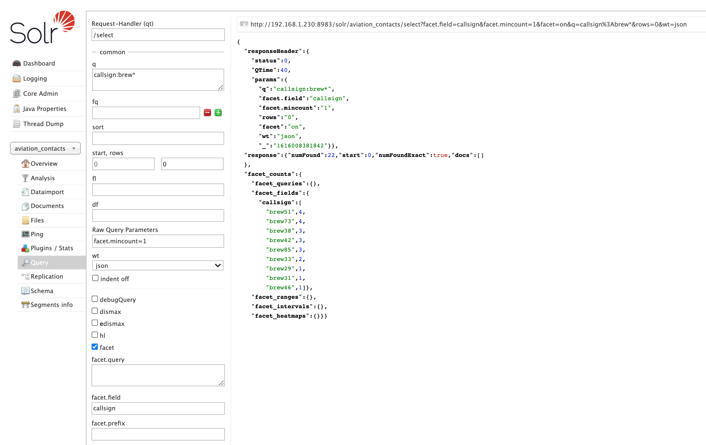
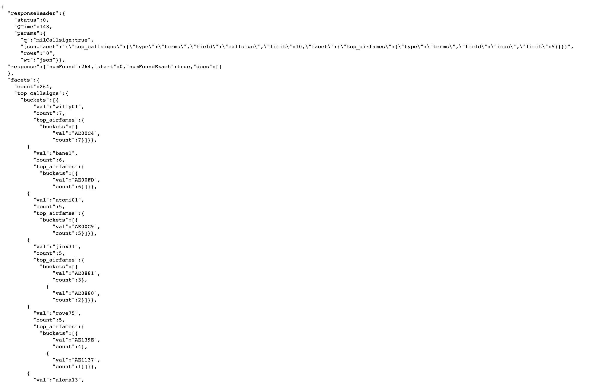

# NewContactsPipeline - New Contacts Solr Indexing Pipeline  
Service to parse dump1090 message traffic, and publish to Solr for indexing.

#### *Work in progress*

## Processor Objectives

## Usage
Operating the MessageParser service

### Application parameters
| Parameter | Environment Variable | Argument Type | Function |
|--- |--- | --- |--- |
| --msg-host | MILTRACK_DUMP1090_HOST | string | hostname or IP of stratux receiver  |
| --msg-port | MILTRACK_DUMP1090_PORT | number | port on which dump1090 SBS messages are published (def. 30003)  | 
| --solr-host | MILTRACK_SOLR_HOST | string | hostname or IP of solr server  |
| --solr-port | MILTRACK_SOLR_PORT | number | port used by Solr for indexing |
| --solr-core | MILTRACK_SOLR_CONTACT_COLLECTION | string | contacts collection canonical name  |
| --dryrun |   | flag | operate in dry-run mode, do not write to Solr |
| --debug |  | flag | writes all parsed message events to STDOUT | 

## Solr Search Results Examples
Some example queries from the Contacts collection `aviation_contacts`  

### All Records Search  
  `/solr/aviation_contacts/select?q=*%3A*`  

### Agregated Results - Top Military Callsigns Used 
  `/solr/aviation_contacts/select?facet.field=callsign&facet=on&q=milCallsign%3Atrue&rows=0`  
  
   
### Military Contacts that with prefix of "BREW"
   `/solr/aviation_contacts/select?facet.field=callsign&facet.mincount=1&facet=on&q=callsign%3Abrew*&rows=0&wt=json`
    

### Top 10 Military Contacts, and airframe sub-count 
Determine which callsigns are the most commonly used, and do these
sorties use the same airframes each time?  
   `/solr/aviation_contacts/select?q=milCallsign%3Atrue&rows=0&wt=json&json.facet={%22top_callsigns%22:{%22type%22:%22terms%22,%22field%22:%22callsign%22,%22limit%22:10,%22facet%22:{%22top_airfames%22:{%22type%22:%22terms%22,%22field%22:%22icao%22,%22limit%22:5}}}}`
    
Of the 264 contacts collected over the last 4 days, the breakdown is:  

    Willy01 - 7 contacts (1 airframe)
    ...
    Jinx31 - 5 contacts (2 airframes)
    Rove75 - 5 contacts (2 airframes)
    ...  
  

