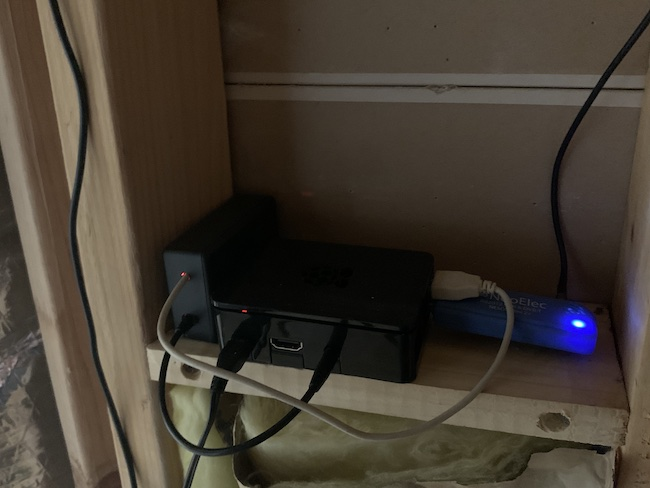
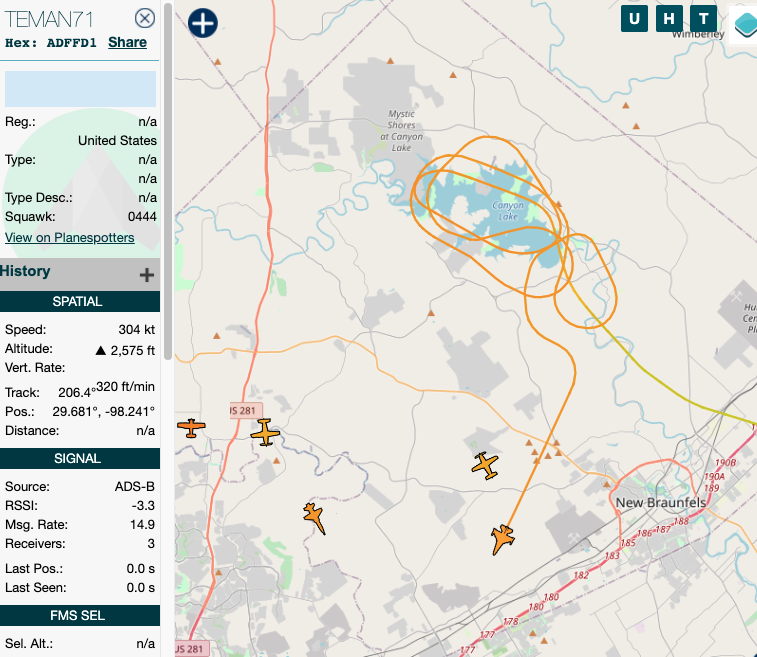

# Military Aviation Tracker  
Project to parse and catalog aircraft ADS-B position signals, exported by the dump1090 service 

#### *Work in progress*

## Aviation Tracker Objectives 
Process data streamed from a Stratux ADS-B receiver to acheive the following objectives.
* Identity all aircraft within 5 miles of Canyon Lake, feeding a dashboard displaying the current over-head aircraft.
* Created a database of aircraft the frequent the Canyon Lake area (sightseeing), including type, elevation, speed. etc.
* Catalog which of the USAF Training Command aircraft are transiting the area, or using area for maneuvers, with an eye
toward determining distribution of callsigns and airframes observed, and which hours they are typically overhead.
* Collect range and bearing data to determine antenna location performance.
* Enable detection of rapidly approaching low-altitude aircraft (e.g. high-speed T38's) to improve success in photographing aircraft.

## Project Components  
### Micro Services
 * MessageParser - Dump1090 BaseStation Broadcast (BSB) message processor  
   * publishes data on ports  9101 -> 9105
   * [Service details](./MicroServices/MessageParser/README.md) 

## Change Log
| Updated | Author | Comments |
| --- | --- |--- |
| 03-MAR-2021 | d.demartini | Project initiated |
| 05-MAR-2021 | d.demartini | write test cases to validate concept and function | 
| 06-MAR-2021 | d.demartini | changed from websocket service to TCP port reader |
| 07-MAR-2021 | d.demartini | added simple caching repository to store new AircraftSBS data objects |
| 08-MAR-2021 | d.demartini | implemented range and bearing formulas (arched triangle calculations) | 
| 10-MAR-2021 | d.demartini | extended function with `--milonly` and `--quiet` features | 
| 11-MAR-2021 | d.demartini | Added New Contact Json feed on port 9101 |
| 11-MAR-2021 | d.demartini | Added new Military Contact Json feed on port 9103 |
| 11-MAR-2021 | d.demartini | Added new In-Range (aka fly-by) Contact Json feed on port 9102 |
| 11-MAR-2021 | d.demartini | Added new In-Range (aka fly-by) Military Contact Json feed on port 9104 |
| 12-MAR-2021 | d.demartini | Added capability to set Environment Variables to configure service |
| 12-MAR-2021 | d.demartini | Added new port (9105) to publish all available data in real time |
| 12-MAR-2021 | d.demartini | Docker enabled |
| 14-MAR-2021 | d.demartini | Preliminary garbage collection to manage in-mem cache size |
| 15-MAR-2021 | d.demartini | Threaded contact manager sweeps out old contacts (gc) from in-mem cache   |
| 15-MAR-2021 | d.demartini | Threaded Console logging resolution option: (low,normal,high,all)  |
| 15-MAR-2021 / d.demartini / Threaded garbage collector removed aged contacts from contacts cache |

----
## Other Information  
### What does the device running Dump1090 consist of?

* Raspberry Pi 3b+ (1GB model)
* NooElec  SDR (RTL)  tuned to 1090 MHz
* NooElec tuned 1090 Mhz antenna (not in photo)
* 5v / 2A  micro USB power supply

_Note:_ the black box to left of Pi enclosure is not related to the Dump1090 / Stratux 
project.  It is an FM stereo transmitter, powered by the Pi's USB used to transmit P25 Phase II decoded LEO repeater traffic.
The rebroadcast of the decoded audio allows monitoring of the local LEO communications from
most of the property.  

### Why the interest?
I enjoy tech projects in general, and any that deal with aviation are of special interest.
Add into that work with radio systems and digital signal processing, and it's just something
that I'm compelled to do.

There are other motivations, one of which is getting a heads-up when one of the USAF
training flights are heading into the area.  Occasionally they turn the lake into a
sort of sight-seeing / high-performance envelope training sorte.  You can see a recent
visit to the area by one of the T38's in this image (snapped by ADS-B Exchange -- awesome data tool!)

  

